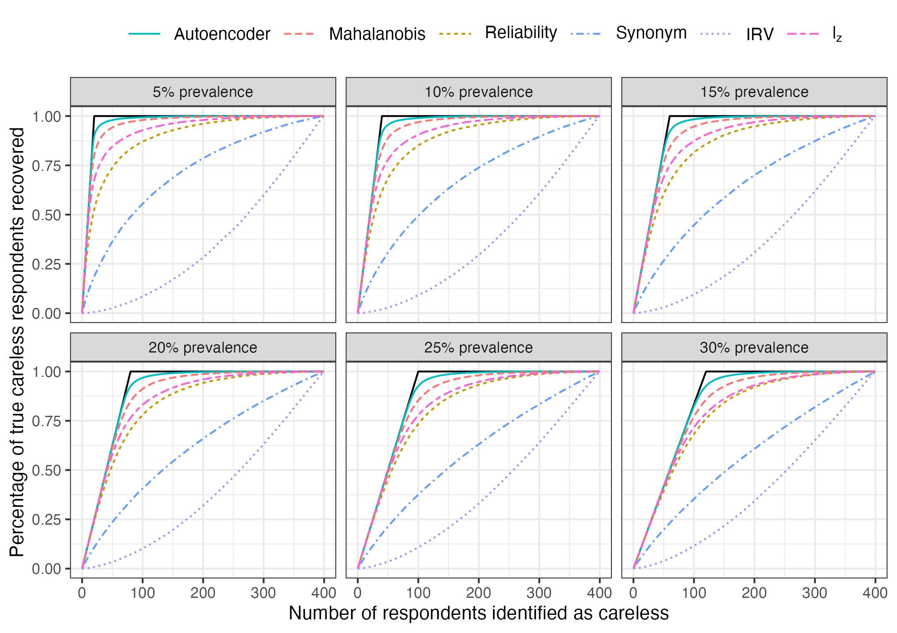
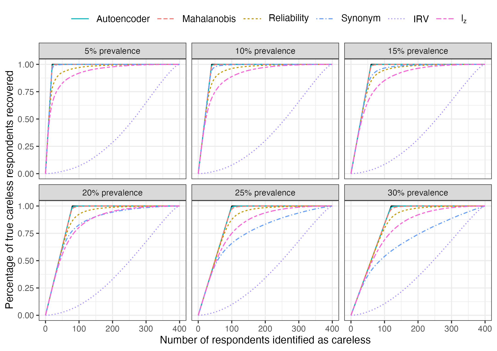
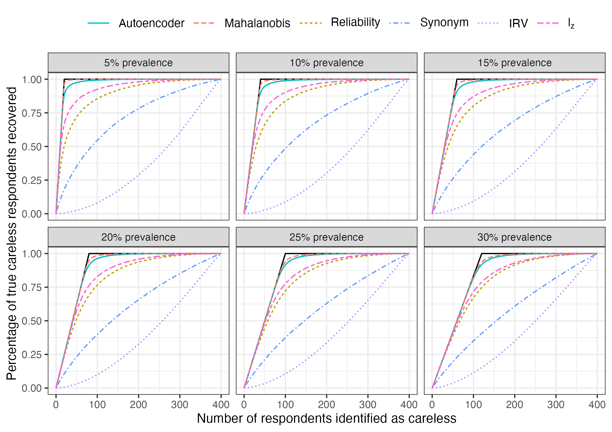

# Online supplement and replication files

This repository presents all results and provides replication files of the simulation experiment in the working paper "[*Open Science Perspectives on Machine Learning for the Identification of Careless Responding: A New Hope or Phantom Menace?*](https://psyarxiv.com/8t2cy)" by Andreas Alfons and Max Welz. 

The simulation experiment compares the performance of six methods for the identification of careless respondents in a hypothetical survey. We refer to this working paper for descriptions of each considered method, as well as a definition of our performance measure (recall curves). As the working paper only reports the results of a selected baseline simulation design, the results remaining simulation designs are discussed in detail here.

There are $n$ participants who respond to $p$ items. Each considered method returns a *carelessness score* for each of the $n$ participants. Depending on whether or not we consider inconsistent or invariable careless responding, scores of careless respondents may be expected to be in the lower or upper tail of the empirical distribution of the $n$ carelessness scores. Specifically, for inconsistent carelessness, scores of careless respondents are expected in the upper tail for the autoencoder, Mahalanobis distances, and IRV, and in the lower tail for personal reliability, psychometric synonyms, and the $l_z$ person-fit. For invariable carelessness, scores of careless respondents are expected in the upper tail for Mahalanobis distances, and in the lower tail for the autoencoder, personal reliability, psychometric synonyms, IRV, and the $l_z$ person-fit.

## Simulation designs

We simulate responses of $n=400$ participants to 30 scales, where each scale is measured by eight items, resulting in a total of $30 \times 8 = 240$ items. All eight items within a given scale follow the same response probability distribution. We consider three distinct types of response distributions for the different scales: centered about the midpoint, skewed towards agreeing, and polarizing (likely to agree or to disagree). For details, we refer to Section 4.2 of the paper. 

We vary three design choices of our baseline simulation design from the paper: the correlation structure of the items, the onset of careless responding, and the types of careless responding.

### Variation of correlation structure

We vary the design of the population correlation matrix of the $p=240$ items as follows. For most designs, we sample a new correlation matrix in each simulation repetition by drawing correlations from certain intervals. If the resulting matrix is not positive semidefinite, we find the nearest positive definite matrix via function `nearPD()` in the `R` package `Matrix` [(Bates et al., 2023)](https://cran.r-project.org/package=Matrix). The correlation structure designs are as follows.

- **Idealized correlation design:** The correlations between items within the same scale are set to 0.6, while items from different scales are uncorrelated. This is an overly stylized design where all items within a scale are relatively highly correlated, whereas items belonging to different scales are uncorrelated. Scale reliability is high in this scenario, since the Cronbach’s $\alpha$ value for all scales under this correlation structure equals 0.923.
-  **Low correlation design:** The correlations between items within the same scale are are randomly drawn from the interval $[0.2, 0.4]$, while items from different scales are uncorrelated. Within-scale correlations are of low magnitude, resulting in moderate scale reliability. The Cronbach’s $\alpha$ values of the scales range between 0.733 and 0.809 across 1,000 repetitions.
- **Moderate correlation design:**  This is the correlation structure used in baseline simulation design of the paper. The correlations between items within the same scale are are randomly drawn from the interval $[0.4, 0.6]$, while items from different scales are uncorrelated. Within-scale correlations are moderate, but resulting in good scale reliability. The Cronbach’s $\alpha$ values of the scales range between 0.869 and 0.905 across 1,000 repetitions.
- **High correlation design:** The correlations between items within the same scale are are randomly drawn from the interval $[0.6, 0.8]$, while items from different scales are uncorrelated. Within-scale correlations are high, resulting in excellent scale reliability. The Cronbach’s $\alpha$ values of the scales range between 0.940 and 0.959 across 1,000 repetitions.
- **Grouped correlation design:** In this design, multiple scales form groups. There are 6 scales in a given group and 5 groups in total. Since there are 8 items in a given scale, there are $8 \times 6 = 48$ items in each group. Each type of scale is present in each group. The correlations between items within the same scale are are randomly drawn from the interval $[0.4, 0.6]$, the correlations betweein items in different scales of the same group are randomly drawn from the interval $[0, 0.2]$, while items from different groups are uncorrelated. Note that unlike the other considered correlation structures, some between-scale correlation are nonzero. Scale reliability is good with Cronbach’s $\alpha$ values of the scales range between 0.872 and 0.903 across 1,000 repetitions.

Note that the correlation matrices described here refer to a situation where no items are reverse-coded (that is, all are positively-worded), such that all correlations are nonnegative. As described in the paper, we produce negatively-worded items by reversing the responses of half of the items in each scale. 

### Variation of onset of careless responding

We consider the following two scenarios that govern from which item onward a given careless respondent starts responding carelessly, which we call the *onset item*. Once carelessness has onset, a respondent responds carelessly for the remainder of the survey.

- **Onset throughout:** This is the setting used in baseline simulation design of the paper. For each careless respondent, randomly draw the carelessness onset item from $\{1,2,\dots, 191, 192\}$, where the 192nd item corresponds to 80% of all items.
- **Late onset**: For each careless respondent, randomly draw the carelessness onset item from $\{144,145,\dots, 191, 192\}$, where the 144th and 192nd items correspond to 60% and 80%, respectively, of all items.

### Variation of type of careless responding

We consider the following careless response styles.

- **Random responding**: This is the careless response style used in baseline simulation design of the paper. Each answer category is chosen randomly with equal probability (20%).
- **Extreme responding**: Randomly choose between the leftmost (1st) and rightmost (5th) answer category, with equal probability (50%).
- **Pattern responding**: Respond according to a fixed, recurring pattern such as 1-2-3-1-2-3 etc. The specific pattern is randomly determined for each careless respondent, and excludes straightlining.
- **Straightlining**: Always choose the same, randomly determined answer category.

Note that the former two types correspond to inconsistent careless responding, whereas the latter two correspond to invariable careless responding.

## Results 

In the following, we plot the recall curves of each method, averaged across 1,000 repetitions. A solid black reference line illustrates the best possible recall curve that can be achieved in each setting (ideal recall curve). The closer a method comes to that reference line, the better its detection performance. 

We emphasize that the simulation results are a proof-of-concept, as the limited number of simulation designs does not suffice to draw general conclusions on the performance of the considered methods.

### Baseline design reported in the paper

#### Design 1: Moderate correlation design, Onset throughout, Random responding

The autoencoder yields the best performance with recall curves being quite close to the respective ideal recall curves, which indicates that it succeeds in assigning the highest carelessness scores predominantly to the careless respondents. Mahalanobis distances are the closest competitor, although there is a clear drop in performance, followed by the $l_z$ person-fit and personal reliability. Psychometric synonyms perform rather poorly, with performance further deteriorating for increasing prevalence level. Even though the careless responses are generated by selecting response categories completely at random, that variability is not high enough to get picked up by IRV. Actually, the fact that the recall curves of IRV lie below a hypothetical diagonal line is an indication that IRV performs worse than randomly labeling respondents as careless.

### Variation of correlation structure

#### Design 2: Idealized correlation design, Onset throughout, Random responding

The autoencoder achieves a near-ideal recall curve, and Mahalanobis distances also perform excellently. Then, the $l_z$ person-fit and personal reliability yield moderate performance, while psychometric synonyms and IRV show poor performance. 

#### Design 3: High correlation design, Onset throughout, Random responding

Both the autoencoder and Mahalanobis distances achieve a near-ideal recall curve for all prevalence levels. As do psychometric synonyms for low prevalence levels (5-10%), but their performance rapidly deteriorates with increasing carelessness prevalence. Personal reliability performs well, the $l_z$ person-fit moderately, and IRV poorly.

#### Design 4: Low correlation design, Onset throughout, Random responding

With low within-scale correlations, all methods experience a sharp drop in performance. This is expected, as low within-scale correlations imply that response patterns of attentive respondents become more similar to random responding. However, the $l_z$ person-fit yields the best performance, followed by the autoencoder. Mahalanobis distances and personal reliability perform underwhelmingly, while psychometric synonyms and IRV perform poorly.

#### Design 5: Grouped correlation design, Onset throughout, Random responding

Additional nonzero correlations between items of different scales help Mahalanobis distances to distinguish random responding from attentive response patters, which is reflected in their near-ideal performance for lower prevalence levels. However, the performance of Mahalanobis distances decreases with increasing prevalence levels. The performance of the autoencoder, on the other hand, remains stable at an excellent level across prevalence levels. The $l_z$ person-fit and personal reliability perform moderately, while psychometric synonyms and IRV perform poorly.

### Variation of onset of careless responding

#### Design 6: Moderate correlation design, Late onset, Random responding

With the onset of careless responding occurring only later in the survey, the autoencoder benefits from more attentive responses from which to learn the structures. Consequently, the autoencoder is clearly the best performing method. Mahalanobis distances perform moderately, the $l_z$ person-fit and personal reliability underwhelmingly, and psychometric synonyms and IRV poorly.

### Variation of type of careless responding

#### Design 7: Moderate correlation design, Onset throughout, Extreme responding

With the large variability exhibited by extreme responding, the autoencoder, Mahalanobis distances, and IRV all achieve near-ideal performance. Personal reliability performs moderately, while psychometric synonyms and the $l_z$ person-fit perform poorly.

#### Design 8: Moderate correlation design, Onset throughout, Pattern responding

The $l_z$ person-fit and personal reliability are the best performing methods, although their performance is moderate at best. The remaining methods perform rather poorly, including the autoencoder.

#### Design 9: Moderate correlation design, Onset throughout, Straightlining

IRV is the best performing method, although its recall curve becomes much flatter after it recovers about 75% of the straightliners. Although personal reliability and the autoencoder are the next best methods, their performance is underwhelming, while the remaining methods perform poorly.

## Discussion

There is considerable heterogeneity in the performance of the methods across the investigated simulation designs. Overall, the autoencoder outperforms the benchmark methods regarding the identification of inconsistent careless respondents, while the benchmark methods exhibit more variability in their performance across simulation designs. Moreover, the excellent performance of the autoencoder remains stable for relatively high prevalence of inconsistent careless responding. 

On the other hand, the autoencoder did not perform well for the two types of invariable careless responding, which is expected since the architecture of the autoencoder is designed to filter random noise rather than repeating patterns. Although the internal structure of the two types of invariable careless responses is different from the internal structure of the attentive responses, there is structure that can be learned by the autoencoder, resulting in overlapping mean squared reconstruction errors (which are used as carelessness scores for the autoencoder) for careless and attentive respondents.

However, we reiterate that the discussion of our findings is limited to the simulation designs we consider, and that the relatively small number of simulation designs does not suffice to draw general conclusions on the performance of the considered methods. Accordingly, our simulation experiment should be viewed as a proof-of-concept that machine learning is a promising direction for further research on the identification of careless responding.

On a final note, keep in mind that in the paper, we use a simple network architecture for the autoencoder that has been proposed 30 years ago for ease of explanation of its basic concept. Since then, great strides have been made in the development of network architectures, which may further boost performance in identifying careless respondents.
